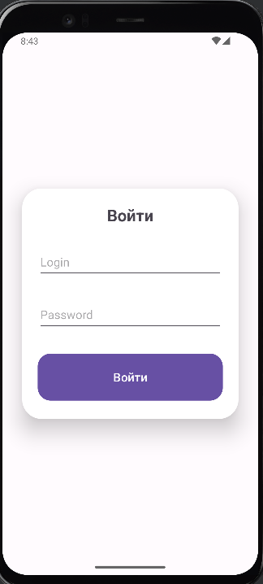
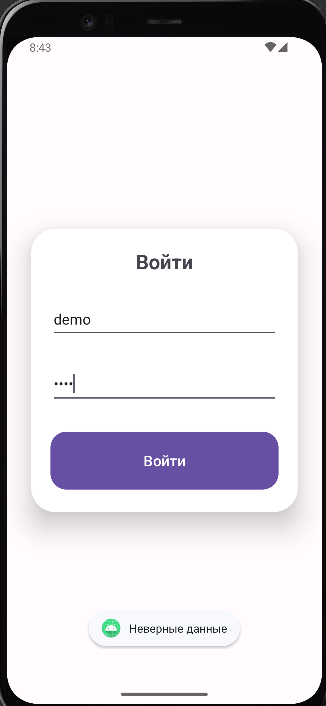
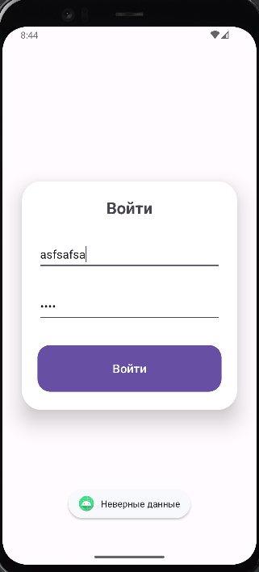
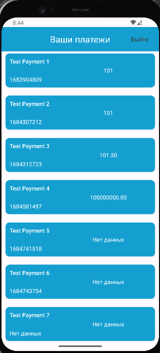

# Тестовое задание для AEON
## Задача:
Сделать приложение с возможностью авторизации пользователя и вывода списка его платежей после успешной авторизации. 
Сделанный проект надо выгрузить в репозиторий на Github. Оценивается как выполнение указанных требований, так и качество проработки отдельных деталей.

# Скриншоты
### Войти
 

### Ошибки

 

## Список платежей
 

## Стек:
* Kotlin
* Coroutines
* Fragments
* Retrofit
* Flow
* Hilt

# Требования к функционалу:
* Если логин/пароль неправильные - выводим ошибку ✔
* Надо предусмотреть возможность logout'а ✔
* корректный вывод списка платежей при ошибочных данных (пропущенные поля, несоответствие типу) ✔
